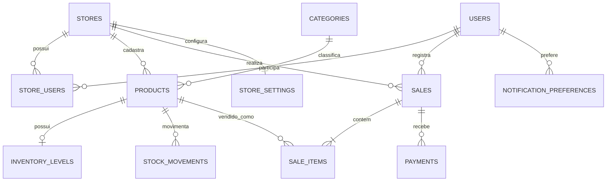

# Bromélia Terrários — levantamento de dados e proposta de esquema

Este documento consolida os dados atualmente representados na interface e propõe um esquema relacional para substituir os dados mockados em memória por persistência real.

## 1. Escopo atual

O sistema contém dados para:

- autenticação e usuários;
- informações cadastrais da loja;
- catálogo de terrários, workshops e insumos de uso interno;
- categorias comerciais;
- estoque e níveis mínimos;
- movimentações de estoque;
- PDV, descontos e formas de pagamento;
- vendas e itens de venda;
- configurações de notificações;
- relatórios de receita e desempenho por produto.

Atualmente, os dados existem apenas em constantes e estados React. Alterações feitas na interface são perdidas ao recarregar a aplicação.

## 2. Convenções recomendadas

- Banco de dados relacional: PostgreSQL.
- Chaves primárias: `uuid`.
- Valores monetários: `numeric(12,2)`, nunca `float`.
- Datas e horários: `timestamptz`.
- Quantidades: `integer` com restrição `>= 0`.
- Nomes técnicos em inglês e textos exibidos em português.
- Exclusão lógica por `active` ou `deleted_at` para produtos e usuários que já participaram de vendas.
- Campos `created_at` e `updated_at` em todas as entidades editáveis.
- Senhas devem ser armazenadas somente como hash seguro. Nunca salvar a senha `admin` em texto puro.

## 3. Visão geral dos relacionamentos



## 4. Enumerações

### `user_role`

| Valor | Uso |
|---|---|
| `admin` | Acesso administrativo completo |
| `seller` | Operação de vendas/PDV |

### `product_type`

| Valor | Vendável | Controla estoque | Uso |
|---|---:|---:|---|
| `terrarium` | Sim | Sim | Terrários prontos |
| `workshop` | Sim | Sim | Vagas disponíveis para workshops |
| `supply` | Não | Sim | Insumos e matérias-primas de uso interno |

### `inventory_status`

| Valor técnico | Texto da interface | Regra |
|---|---|---|
| `in_stock` | Em Estoque | `quantity > minimum_quantity` |
| `low_stock` | Estoque Baixo | `quantity > 0 AND quantity <= minimum_quantity` |
| `out_of_stock` | Sem Estoque | `quantity = 0` |

O status pode ser calculado em consulta e não precisa ser persistido.

### `sale_status`

| Valor técnico | Texto da interface |
|---|---|
| `pending` | Pendente |
| `paid` | Pago |
| `cancelled` | Cancelado |
| `refunded` | Estornado |

### `payment_method`

| Valor técnico | Texto da interface |
|---|---|
| `pix` | Pix |
| `card` | Cartão |
| `cash` | Dinheiro |

### `stock_movement_type`

| Valor | Uso |
|---|---|
| `opening_balance` | Saldo inicial |
| `purchase` | Entrada por compra/reposição |
| `manual_in` | Entrada manual |
| `manual_out` | Saída manual |
| `sale` | Saída causada por venda |
| `production` | Consumo de insumo na produção |
| `adjustment` | Correção de inventário |
| `cancellation` | Devolução causada por cancelamento |

## 5. Tabelas propostas

### 5.1 `stores`

Dados cadastrais exibidos em Configurações.

| Coluna | Tipo | Restrições/observações |
|---|---|---|
| `id` | `uuid` | PK |
| `name` | `varchar(120)` | Obrigatório |
| `cnpj` | `varchar(18)` | Único; salvar somente dígitos ou padronizar máscara |
| `email` | `varchar(254)` | Obrigatório |
| `phone` | `varchar(30)` | Obrigatório |
| `address_line` | `varchar(200)` | Obrigatório |
| `city` | `varchar(100)` | Obrigatório |
| `state` | `char(2)` | Ex.: `SP` |
| `active` | `boolean` | Padrão `true` |
| `created_at` | `timestamptz` | Padrão `now()` |
| `updated_at` | `timestamptz` | Atualização automática |

**Registro atual**

| name | cnpj | email | phone | address_line | city | state |
|---|---|---|---|---|---|---|
| Bromélia Terrários | 12.345.678/0001-99 | ola@bromeliaterrarios.com.br | (11) 99999-8888 | Rua das Bromélias, 42 | São Paulo | SP |

### 5.2 `users`

| Coluna | Tipo | Restrições/observações |
|---|---|---|
| `id` | `uuid` | PK |
| `username` | `varchar(80)` | Único, obrigatório |
| `display_name` | `varchar(120)` | Obrigatório |
| `email` | `varchar(254)` | Único, opcional |
| `password_hash` | `text` | Obrigatório |
| `active` | `boolean` | Padrão `true` |
| `last_login_at` | `timestamptz` | Opcional |
| `created_at` | `timestamptz` | Padrão `now()` |
| `updated_at` | `timestamptz` | Atualização automática |

### 5.3 `store_users`

Permite que um usuário tenha papel por loja.

| Coluna | Tipo | Restrições/observações |
|---|---|---|
| `store_id` | `uuid` | FK → `stores.id` |
| `user_id` | `uuid` | FK → `users.id` |
| `role` | `user_role` | Obrigatório |
| `created_at` | `timestamptz` | Padrão `now()` |

Chave primária composta: `(store_id, user_id)`.

**Dados representados na interface**

- Administrador: usuário `admin` (“você”).
- Vendedor: 1 usuário ativo, ainda sem nome ou credenciais definidos.
- Credenciais temporárias do protótipo: `admin` / `admin`. Em produção, criar o usuário por fluxo seguro e armazenar apenas o hash.

### 5.4 `categories`

| Coluna | Tipo | Restrições/observações |
|---|---|---|
| `id` | `uuid` | PK |
| `name` | `varchar(100)` | Obrigatório |
| `slug` | `varchar(100)` | Único |
| `product_type` | `product_type` | Define onde a categoria pode ser usada |
| `sellable` | `boolean` | Categorias comerciais = `true` |
| `sort_order` | `smallint` | Ordem na interface |
| `active` | `boolean` | Padrão `true` |

**Categorias comerciais atuais**

| name | slug | product_type | sellable | sort_order |
|---|---|---|---:|---:|
| Terrários pequenos | `terrarios-pequenos` | `terrarium` | true | 1 |
| Terrários médios | `terrarios-medios` | `terrarium` | true | 2 |
| Terrários grandes | `terrarios-grandes` | `terrarium` | true | 3 |
| Workshops | `workshops` | `workshop` | true | 4 |

**Categorias de insumos atuais**

| name | slug | product_type | sellable |
|---|---|---|---:|
| Substrato | `substrato` | `supply` | false |
| Recipiente | `recipiente` | `supply` | false |
| Planta | `planta` | `supply` | false |
| Pedra | `pedra` | `supply` | false |
| Ferramenta | `ferramenta` | `supply` | false |
| Outro | `outro` | `supply` | false |

### 5.5 `products`

Unifica terrários, workshops e insumos. O campo `sellable` impede que insumos apareçam no PDV.

| Coluna | Tipo | Restrições/observações |
|---|---|---|
| `id` | `uuid` | PK |
| `store_id` | `uuid` | FK → `stores.id` |
| `category_id` | `uuid` | FK → `categories.id` |
| `type` | `product_type` | Obrigatório |
| `name` | `varchar(160)` | Obrigatório |
| `sku` | `varchar(60)` | Único por loja |
| `cost_price` | `numeric(12,2)` | `>= 0` |
| `sale_price` | `numeric(12,2)` | Obrigatório quando `sellable = true` |
| `cost_unit` | `varchar(20)` | Ex.: `un`, `kg`; padrão `un` |
| `sellable` | `boolean` | `false` para insumos |
| `image_url` | `text` | URL ou caminho em storage |
| `active` | `boolean` | Padrão `true` |
| `created_at` | `timestamptz` | Padrão `now()` |
| `updated_at` | `timestamptz` | Atualização automática |

### 5.6 `inventory_levels`

| Coluna | Tipo | Restrições/observações |
|---|---|---|
| `product_id` | `uuid` | PK e FK → `products.id` |
| `quantity` | `integer` | `>= 0` |
| `minimum_quantity` | `integer` | `>= 0` |
| `updated_at` | `timestamptz` | Atualização automática |

**Catálogo e estoque inicial da interface**

| Produto | Tipo | Categoria | SKU | Qtd. | Mínimo | Custo | Preço de venda | Status |
|---|---|---|---|---:|---:|---:|---:|---|
| Fittonia Ecosystem | Terrário | Terrários pequenos | TER-FIT-001 | 8 | 5 | R$ 95,00 | R$ 245,00 | Em Estoque |
| Terrário Aurora | Terrário | Terrários pequenos | TER-AUR-002 | 14 | 6 | R$ 55,00 | R$ 185,00 | Em Estoque |
| Terrário Cactos Deserto | Terrário | Terrários médios | TER-CAC-003 | 3 | 5 | R$ 80,00 | R$ 265,00 | Estoque Baixo |
| Workshop Jardim no Vidro | Workshop | Workshops | WKS-JAR-001 | 12 | 4 | R$ 60,00 | R$ 150,00 | Em Estoque |
| Jardim Orquídeas | Terrário | Terrários grandes | TER-ORC-005 | 5 | 4 | R$ 120,00 | R$ 320,00 | Em Estoque |
| Musgo Sphagnum | Insumo | Substrato | INS-MOS-001 | 2 | 10 | R$ 18,00/kg | Não vendável | Estoque Baixo |
| Vidro Borossilicato 20cm | Insumo | Recipiente | INS-VID-002 | 45 | 20 | R$ 35,00/un | Não vendável | Em Estoque |
| Fittonia Albivenis | Insumo | Planta | INS-PLT-003 | 4 | 15 | R$ 12,00/un | Não vendável | Estoque Baixo |
| Carvão Ativado | Insumo | Substrato | INS-CAR-004 | 18 | 5 | R$ 8,00/kg | Não vendável | Em Estoque |
| Areia Decorativa Rosa | Insumo | Substrato | INS-ARE-005 | 3 | 8 | R$ 22,00/kg | Não vendável | Estoque Baixo |

**Produto presente no PDV, mas ausente no estoque mockado**

| Produto | Tipo | Categoria | Preço |
|---|---|---|---:|
| Terrário Bromélia Imperial | Terrário | Terrários grandes | R$ 395,00 |

Antes da migração, cadastrar SKU, custo, quantidade e nível mínimo desse produto.

### 5.7 `stock_movements`

Registra toda alteração de quantidade e evita histórico de estoque perdido.

| Coluna | Tipo | Restrições/observações |
|---|---|---|
| `id` | `uuid` | PK |
| `store_id` | `uuid` | FK → `stores.id` |
| `product_id` | `uuid` | FK → `products.id` |
| `type` | `stock_movement_type` | Obrigatório |
| `quantity_delta` | `integer` | Positivo para entrada, negativo para saída |
| `quantity_before` | `integer` | Auditoria |
| `quantity_after` | `integer` | Auditoria |
| `unit_cost` | `numeric(12,2)` | Opcional |
| `sale_id` | `uuid` | FK opcional → `sales.id` |
| `notes` | `text` | Opcional |
| `created_by` | `uuid` | FK → `users.id` |
| `created_at` | `timestamptz` | Padrão `now()` |

### 5.8 `sales`

| Coluna | Tipo | Restrições/observações |
|---|---|---|
| `id` | `uuid` | PK |
| `store_id` | `uuid` | FK → `stores.id` |
| `sale_number` | `bigint` | Sequencial por loja |
| `status` | `sale_status` | Padrão `pending` |
| `subtotal` | `numeric(12,2)` | Soma dos itens antes do desconto |
| `discount_percent` | `numeric(5,2)` | Entre `0` e `100` |
| `discount_amount` | `numeric(12,2)` | Valor monetário aplicado |
| `total` | `numeric(12,2)` | `subtotal - discount_amount` |
| `created_by` | `uuid` | FK → `users.id` |
| `paid_at` | `timestamptz` | Preenchido ao confirmar pagamento |
| `created_at` | `timestamptz` | Padrão `now()` |
| `updated_at` | `timestamptz` | Atualização automática |

### 5.9 `sale_items`

Os nomes e preços são copiados para preservar o histórico mesmo após alterações no produto.

| Coluna | Tipo | Restrições/observações |
|---|---|---|
| `id` | `uuid` | PK |
| `sale_id` | `uuid` | FK → `sales.id` |
| `product_id` | `uuid` | FK → `products.id` |
| `product_name_snapshot` | `varchar(160)` | Obrigatório |
| `sku_snapshot` | `varchar(60)` | Obrigatório |
| `unit_price` | `numeric(12,2)` | Preço no momento da venda |
| `unit_cost_snapshot` | `numeric(12,2)` | Necessário para margem histórica |
| `quantity` | `integer` | `> 0` |
| `line_total` | `numeric(12,2)` | `unit_price * quantity` |

### 5.10 `payments`

| Coluna | Tipo | Restrições/observações |
|---|---|---|
| `id` | `uuid` | PK |
| `sale_id` | `uuid` | FK → `sales.id` |
| `method` | `payment_method` | Pix, cartão ou dinheiro |
| `amount` | `numeric(12,2)` | `> 0` |
| `status` | `varchar(30)` | `pending`, `approved`, `failed`, `refunded` |
| `external_reference` | `varchar(160)` | Opcional |
| `paid_at` | `timestamptz` | Opcional |
| `created_at` | `timestamptz` | Padrão `now()` |

### 5.11 `store_settings`

| Coluna | Tipo | Restrições/observações |
|---|---|---|
| `store_id` | `uuid` | PK e FK → `stores.id` |
| `low_stock_alert_enabled` | `boolean` | Atual: `true` |
| `default_low_stock_quantity` | `integer` | Atual: `5` |
| `sales_alert_email` | `boolean` | Atual: `true` |
| `sales_alert_whatsapp` | `boolean` | Atual: `true` |
| `weekly_report_enabled` | `boolean` | Atual: `true` |
| `weekly_report_weekday` | `smallint` | Atual: segunda-feira (`1`) |
| `timezone` | `varchar(50)` | Recomendado: `America/Sao_Paulo` |
| `updated_at` | `timestamptz` | Atualização automática |

### 5.12 `notification_preferences`

Opcional para preferências diferentes por usuário.

| Coluna | Tipo | Restrições/observações |
|---|---|---|
| `id` | `uuid` | PK |
| `user_id` | `uuid` | FK → `users.id` |
| `store_id` | `uuid` | FK → `stores.id` |
| `event_type` | `varchar(50)` | Ex.: `low_stock`, `sale_completed`, `weekly_report` |
| `channel` | `varchar(20)` | Ex.: `email`, `whatsapp`, `in_app` |
| `enabled` | `boolean` | Padrão `true` |

Restrição única recomendada: `(user_id, store_id, event_type, channel)`.

## 6. Dados comerciais atuais

### Produtos disponíveis no PDV

| Produto | Categoria | Preço |
|---|---|---:|
| Fittonia Ecosystem | Terrários pequenos | R$ 245,00 |
| Terrário Aurora | Terrários pequenos | R$ 185,00 |
| Terrário Cactos | Terrários médios | R$ 265,00 |
| Workshop Jardim no Vidro | Workshops | R$ 150,00 |
| Jardim Orquídeas | Terrários grandes | R$ 320,00 |
| Terrário Bromélia Imperial | Terrários grandes | R$ 395,00 |

Insumos não podem ser vendidos e devem ser filtrados no backend por `sellable = true`.

### Vendas recentes mockadas

| Número | Produto | Quantidade | Total | Status |
|---|---|---:|---:|---|
| #001 | Fittonia Ecosystem | 2 | R$ 490,00 | Pago |
| #002 | Terrário Aurora | 1 | R$ 185,00 | Pago |
| #003 | Workshop Jardim no Vidro | 3 | R$ 450,00 | Pendente |
| #004 | Terrário Cactos | 1 | R$ 265,00 | Pago |

Esses registros devem ser migrados como vendas e itens de venda, não como uma tabela separada de “vendas recentes”.

### Regras do PDV

- Desconto percentual permitido entre `0%` e `100%`.
- Atalhos existentes: `5%`, `10%`, `15%` e `20%`.
- Total: `subtotal - (subtotal * discount_percent / 100)`.
- Formas de pagamento: Pix, cartão e dinheiro.
- Uma venda somente pode ser finalizada quando tiver pelo menos um item.
- Ao finalizar uma venda paga, registrar pagamento e movimentar estoque em uma única transação.
- Workshops usam a quantidade como número de vagas disponíveis.

## 7. Relatórios e dados derivados

Os indicadores devem ser calculados a partir de `sales`, `sale_items`, `payments` e `products`. Não é necessário persistir cards ou gráficos em tabelas próprias.

### Receita e pedidos mensais atualmente exibidos

Período: janeiro a setembro de 2026.

| Mês | Receita | Pedidos |
|---|---:|---:|
| Jan/2026 | R$ 3.200,00 | 14 |
| Fev/2026 | R$ 4.100,00 | 19 |
| Mar/2026 | R$ 3.800,00 | 16 |
| Abr/2026 | R$ 4.200,00 | 21 |
| Mai/2026 | R$ 5.800,00 | 27 |
| Jun/2026 | R$ 5.100,00 | 23 |
| Jul/2026 | R$ 7.300,00 | 34 |
| Ago/2026 | R$ 6.800,00 | 31 |
| Set/2026 | R$ 9.200,00 | 47 |
| **Total** | **R$ 49.500,00** | **232** |

### Desempenho por produto atualmente exibido

| Produto | Vendas | Margem |
|---|---:|---:|
| Workshop Jardim no Vidro | 22 | 59% |
| Fittonia Ecosystem | 18 | 61% |
| Terrário Aurora | 14 | 70% |
| Terrário Cactos | 11 | 70% |
| Jardim Orquídeas | 9 | 63% |

**Cálculos recomendados**

- Receita total: soma de `sales.total` para vendas pagas.
- Total de pedidos: contagem de vendas pagas.
- Quantidade vendida: soma de `sale_items.quantity` em vendas pagas.
- Margem por item: `(unit_price - unit_cost_snapshot) / unit_price * 100`.
- Margem por produto: margem ponderada pelas quantidades vendidas.
- Valor em estoque: soma de `inventory_levels.quantity * products.cost_price`.
- Alertas de estoque: produtos com quantidade igual ou inferior ao mínimo.

### Participação das categorias nas vendas

| Categoria | Participação atual |
|---|---:|
| Terrários pequenos | 35% |
| Terrários médios | 30% |
| Terrários grandes | 23% |
| Workshops | 12% |

Esse percentual deve ser derivado da receita ou da quantidade vendida. A implementação precisa escolher e documentar uma única base; recomenda-se receita.

## 8. Regras de integridade

1. SKU deve ser único dentro da loja.
2. Produto do tipo `supply` deve ter `sellable = false`.
3. Produto do tipo `workshop` deve pertencer à categoria Workshops.
4. Preço de venda é obrigatório para produtos vendáveis.
5. Quantidade e nível mínimo não podem ser negativos.
6. Insumos podem ter unidade de custo `kg` ou `un`, mas não aparecem no PDV.
7. Venda paga não deve ser apagada; use cancelamento ou estorno.
8. Cancelamento deve gerar movimentação inversa de estoque.
9. Totais da venda devem ser validados no servidor, sem confiar nos valores enviados pelo frontend.
10. Status de estoque deve ser calculado com base em quantidade e mínimo.
11. Imagens devem ser armazenadas em serviço de arquivos; o banco mantém apenas URL e metadados.
12. Alterações de estoque devem gerar `stock_movements`.

## 9. Índices recomendados

```text
users(username) UNIQUE
users(email) UNIQUE WHERE email IS NOT NULL
categories(slug) UNIQUE
products(store_id, sku) UNIQUE
products(store_id, sellable, active)
products(category_id)
inventory_levels(quantity, minimum_quantity)
stock_movements(product_id, created_at DESC)
sales(store_id, created_at DESC)
sales(store_id, status, paid_at DESC)
sale_items(sale_id)
sale_items(product_id)
payments(sale_id)
```

## 10. Ordem recomendada de implementação

1. Criar enums, `stores`, `users` e `store_users`.
2. Criar `categories`, `products` e `inventory_levels`.
3. Importar o catálogo e os saldos iniciais.
4. Criar `stock_movements` e substituir os controles locais de quantidade.
5. Criar `sales`, `sale_items` e `payments`.
6. Integrar o PDV com transação atômica de venda, pagamento e estoque.
7. Criar `store_settings` e persistir as configurações da loja.
8. Substituir os dados estáticos dos relatórios por consultas agregadas.
9. Implementar autenticação real e autorização por papel.

## 11. Pontos pendentes antes da migração

- Definir dados completos do usuário vendedor.
- Definir SKU, custo e estoque do Terrário Bromélia Imperial.
- Confirmar se a quantidade de workshops representa vagas totais ou vagas restantes.
- Definir se a participação por categoria usa receita ou unidades vendidas.
- Definir política de reserva de estoque para vendas pendentes.
- Separar endereço em rua, número, complemento, bairro e CEP caso sejam necessários emissão fiscal ou entregas.
- Definir integração de pagamento e os identificadores externos.
- Confirmar se o CNPJ e os contatos atuais são reais ou apenas dados de demonstração.
